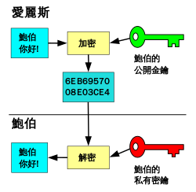
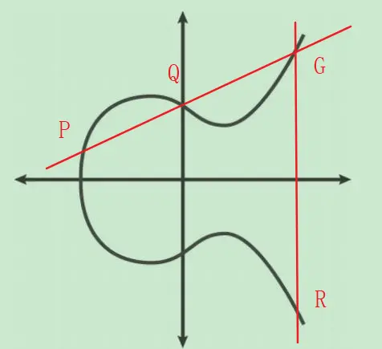

# 实验一 椭圆曲线算法

## 实验目的

- 理解非对称加密算法
- 理解椭圆曲线算法ECC
- 实现比特币上的椭圆曲线secp256k1算法

## 实验介绍

### 非对称加密算法

公开密钥密码学（英语：Public-key cryptography）也称非对称式密码学（英语：Asymmetric cryptography）是密码学的一种算法，它需要两个密钥，一个是公开密钥，另一个是私有密钥；公钥用作加密，私钥则用作解密。使用公钥把明文加密后所得的密文，只能用相对应的私钥才能解密并得到原本的明文，最初用来加密的公钥不能用作解密。由于加密和解密需要两个不同的密钥，故被称为非对称加密；不同于加密和解密都使用同一个密钥的对称加密。公钥可以公开，可任意向外发布；私钥不可以公开，必须由用户自行严格秘密保管，绝不透过任何途径向任何人提供，也不会透露给被信任的要通信的另一方。



### 陷门函数

所有公钥加密算法的关键在于它们各自都有其独特的陷门函数。陷门函数只能被单向计算，或者至少只能容易地单向计算（使用现代计算机在不到几百万年的时间内）

### ECC算法

ECC是椭圆曲线加密（Elliptic Curve Cryptography）的缩写，在网络通信以及区块链系统中最常用的加密算法之一。一条椭圆曲线就是一组被$y^2 = x^3 + ax +b$定义的且满足$4a^3 + 27b^2 \neq 0$的点集。

在ECC算法中，陷门函数函数是建立在 “有限域上的二元三次曲线上的点”上 ，组成一个[阿贝尔群](https://zh.wikipedia.org/zh/%E9%98%BF%E8%B4%9D%E5%B0%94%E7%BE%A4) （满足封闭性，结合性，有单位元，有逆元）。

在椭圆曲线上的加法采用一种几何加法的方式。首先，在椭圆曲线上取一点P(Xp,Yp)，再取一点Q(Xq,Yq)，连接P、Q两点作一条直线，这条直线将在椭圆曲线上交于第三点G，过G点作垂直于X轴的直线，将过椭圆曲线另一点R（一般是关于X轴对称的点），R点则被定义为P+Q的结果，既P+Q=R。



一个公钥密码学方案使用的椭圆曲线通过如下变量定义：

- 确定曲线$y^2 = x^3 + ax + b$中的a和b
- 确定有限域需要的素数p
- 确定起点G坐标(x,y)
- 确定通过G生成的群阶数n

ECC算法是在有限域Fp定义公式：Q=kP，已知大数k和点P的情况下，很容易求点Q，但是已知的点P、点Q，却很难求得k，这就是经典的离散对数问题，ECC算法正是利用该特点进行加密，点Q为公钥，大数k为私钥，点P为基点。

### 理解签名和验签

为了帮助理解签名和验证存在的动机，我们想象下面的场景。你想证明你是一个优秀的弓箭手，有能力在 500 码 （约 457 米）内，射中任何选定物体。现在，如果有人可以观察到你，并与你互动，那么要证明你的能力并不困难。他可以把你的儿子放置在 400 码的距离，头顶一个苹果，让你用箭射中苹果。作为一个优秀的弓箭手，你可以完成这个挑战来证明你的能力。验证者选定的靶使得你的箭术很容易被验证。

不幸的是，这种方法缺乏扩展性。比如你想证明给 10 个人看，你需要完成 10 次不同的挑战，射出 10 支箭，射向 10 个不同的靶。你可以让 10 个人围观你射一箭，但是因为不可能让 10 个人都指定靶，所以他们总会怀疑你是否只擅长特定的靶，而非任意的靶。我们希望，你只完成一次，且不需要和观察者交流，但他们仍然确信你是一个优秀的弓箭手，可以射中任意的靶。

比如，你简单地射中了你选定的目标，人们观测后并没有信服。毕竟有可能是你先射箭后画靶。那么你应该怎么做呢？

你可选择一种非常机智的方法。在箭的箭头上雕刻你要射中的靶的坐标（孩子头上的苹果），之后用箭射中你的靶。现在任何看到靶的人都可以使用 X 光机看看嵌入的箭头的坐标是否是靶的位置。很明显，必须在箭头射入靶之前就雕刻好坐标。所以他们可以相信你是一个优秀的弓箭手（假设这个靶并不是你反复多次练习过的）。

签名和验证使用的是相同的技巧，我们要证明的东西从优秀的箭术变为掌握一个隐秘的数字。我们希望证明我们掌握这个数字但不透露这个数字本身。这可以通过把“靶”放进计算过程，然后击中“靶”来实现

### 椭圆曲线上的签名和验签


雕刻靶坐标依赖椭圆曲线数字签名算法（Elliptic Curve Digital Signature Algorithm，ECDSA），算法需要保护的秘密e满足下面的等式：eG = P, P是公钥，e是私钥。

我们选定的靶是一个 256 位的随机数k，并且有：kG = R

于是R替换成为新的靶，实际上我们只关心R的x轴坐标，将其命名为r。

我们宣称下面的方程等价于离散对数问题：
$$
uG + vP = kG
$$
k是随机选取的，u和v由签名者提供且均不等于 0，G和P是已知的。这个命题成立是因为：
$$
uG + vP = kG⇒vP = (k–u)G
$$
由于v≠ 0，所以可以通过除以标量乘法的系数v得到：P = ((k–u)/v)G
如果e已知，则有：eG = ((k–u)/v)G或者e = (k–u)/v这意味着对于任何（u，v）的组合，只要满足上述方程，将足以证明其为e持有者。如果我们不知道e，则不得不穷举（u，v）直到e = (k–u)/v。如果我们能提供满足方程的任意（u，v）组合，这意味着我们在只知道P和G的情况下，已经解决了P = eG的离散对数问题。换句话说，我们破解了离散对数问题

在签名和验证的语境下， 这被称为签名哈希（signature hash）。 哈希函数（hash）是确定性函数， 接受任意数据并转化为定长。签名函数是包含射击者意图的消息指纹，任何验证消息的人都会接收它，用字母z表示。可通过如下的方式把它雕刻在 uG+vP 的计算中。

$u = z/s, v = r/s$

我们知道r参与了v的计算，所以箭头已经雕刻了目标。通过u的计算，我们也雕刻了射击的目的。所以射击的靶和射击的原因都已经在方程中了。

为了使方程成立，接下来计算s：

$$
uG + vP = R = kG \\
uG + veG = kG\\
u + ve = k \\
z/s + re/s = k\\
(z + re)/s = k\\
s = (z + re)/k
$$

这就是基础的签名算法，签名的数字是r和s。

验证过程也非常直接明了：


$$
uG + vP，其中 e u, v ≠ 0 \\
uG + vP = (z/s)G + (re/s)G = ((z + re)/s)G = ((z + re)/((z + re)/k))G = kG = (r, y)
$$

### secp256k1算法

secp256k1是指比特币中使用的ECDSA(椭圆曲线数字签名算法)曲线的参数，并且在高效密码学标准（Certicom Research，http://www.secg.org/sec2-v2.pdf）中进行了定义。

在比特币使用的曲线secp256k1中使用的参数如下：

- a = 0, b=7, 曲线为$y^2 = x^3 + 7$
- $p = 2^256 - 2^32 - 977$
- Gx = 0x79BE667EF9DCBBAC55A06295CE870B07029BFCDB2DCE28D959F2815B16F81798
- Gy = 0x483ADA7726A3C4655DA4FBFC0E1108A8FD17B448A68554199C47D08FFB10D4B8
- n = 0xFFFFFFFFFFFFFFFFFFFFFFFFFFFFFFFEBAAEDCE6AF48A03BBFD25E8CD0364141

其中，Gx, Gy 为G点的x坐标和y坐标， a,b 为选用的曲线参数，p为选取的一个非常接近$2^{256}$的素数，这意味着大部分小于$2^{256}$的素数都在这个素数域内。


### secp256k1基本流程

#### 签名流程
1. 我们已知z和满足eG=P的e。
2. 随机选取k。
3. 计算R=kG,及其x轴坐标r。
4. 计算 s=(z+re)/k。
5. (r,s) 即为签名结果。

#### 验证流程

1. 接收签名者提供的(r,s)作为签名，z是被签名的内容的哈希值。P是签名者的公钥（或者公开的点）。
2. 计算 u=z/s 和 v=r/s。
3. 计算 uG + vP = R。
4. 如果R的x轴坐标等于r，则签名是有效的

## 实验内容
完成签名和验签对应的函数部分

### 实现部分：

```
type ECC interface {
    Sign(msg []byte, secKey *big.Int) (*Signature, error)
    VerifySignature(msg []byte, signature *Signature, pubkey *Point) bool
}
```

## 补充

- 取1/s的操作通过费马小定理来实现，在函数中`Inv(s *big.Int, N *big.Int) *big.Int` 已经实现。
- 群的阶数为N，在对于数据操作之后，需要进行求余运算`MOD`
- 哈希函数在secp256k1中选用的是双sha256函数，可以通过`crypto.Keccak256([]byte)` 来实现
- big.Int上的操作可以查看 https://pkg.go.dev/math/big#Int


## 补充资料

[比特币白皮书](https://bitcoin.org/bitcoin.pdf)

[比特币代码](https://github.com/bitcoin/bitcoin)

[Go语言指南](https://tour.go-zh.org/)

[Go圣经](https://github.com/golang-china/gopl-zh)